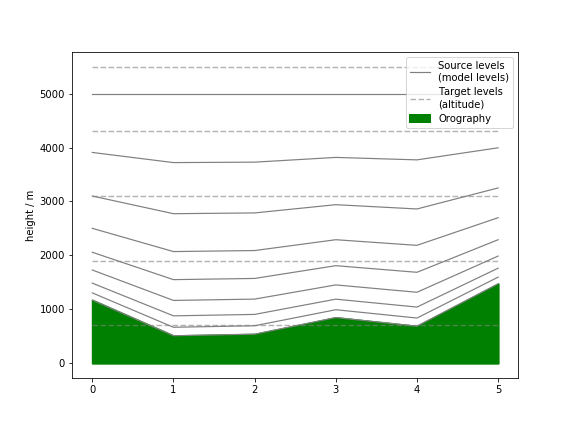

# Stratify

[](https://travis-ci.org/SciTools-incubator/python-stratify) [](http://mybinder.org:/repo/scitools-incubator/python-stratify)

Interpolation for restratification, particularly useful for Nd vertical interpolation of atmospheric and oceanographic datasets

## Introduction

Discover the capabilites of `stratify` with this introductory [notebook](index.ipynb).

[](index.ipynb)

## Installation

```shell
conda install -c scitools python-stratify
```

## License
Stratify is licenced under a [BSD 3-Clause License](LICENSE).

